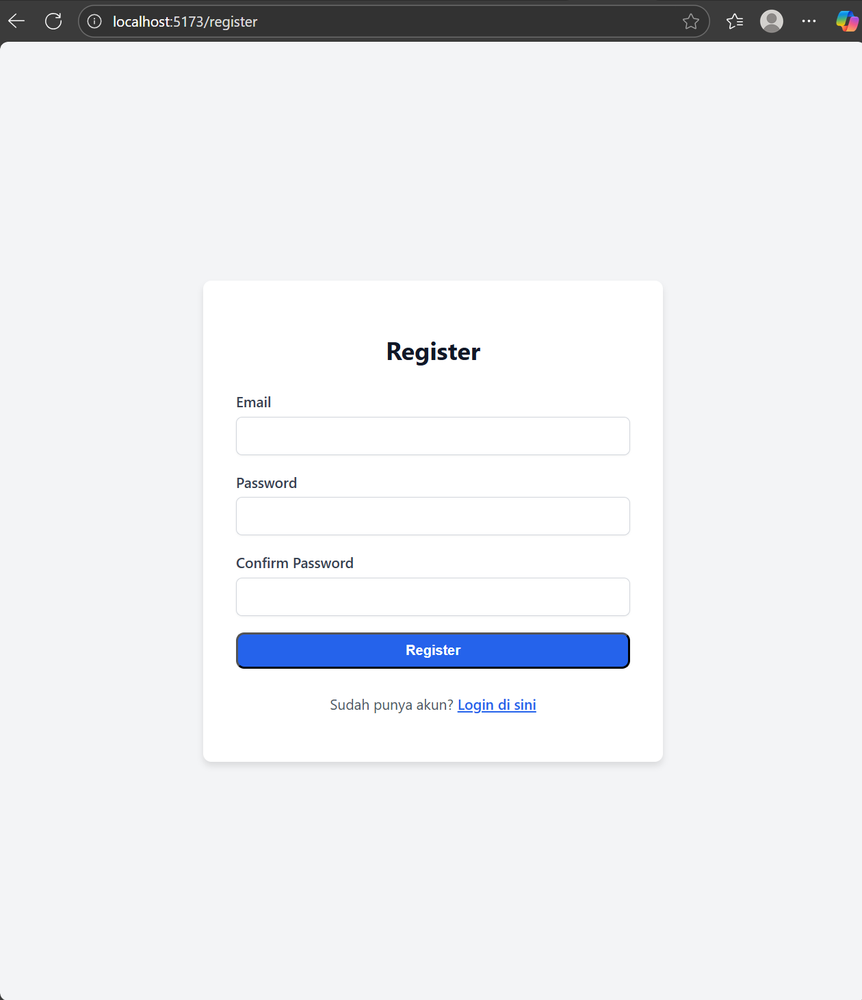
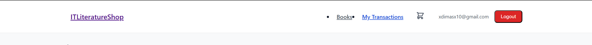
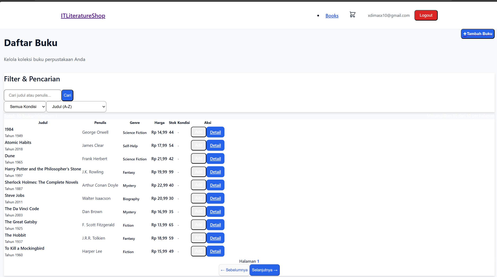
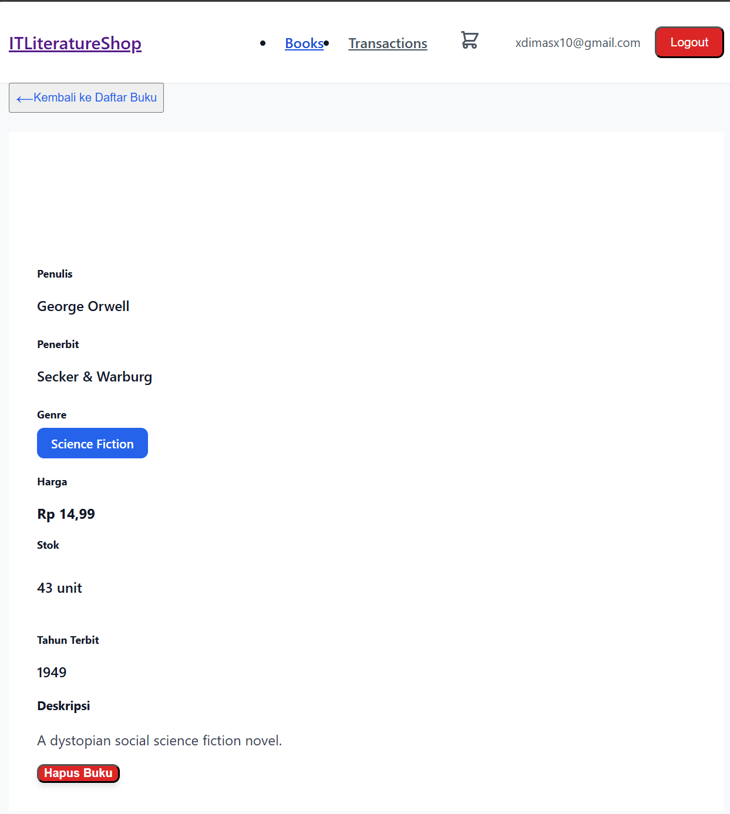
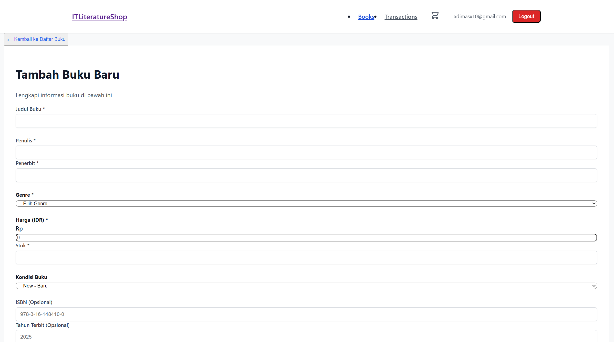
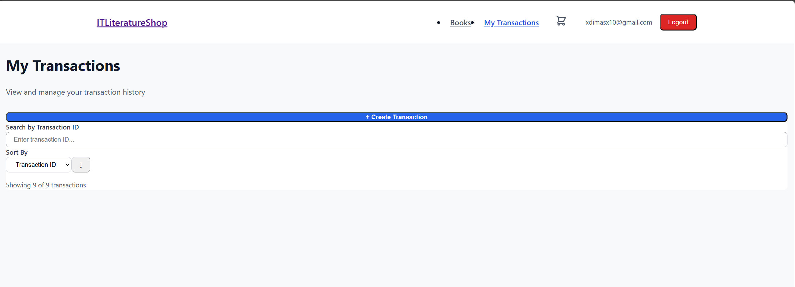
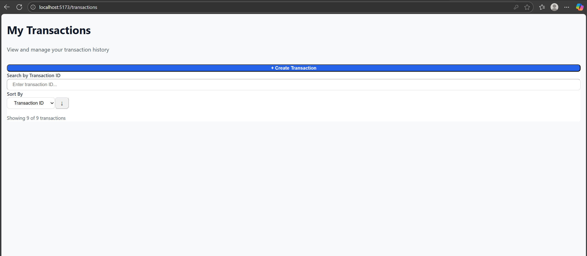

Praktikum Pemrograman Web - ReactJS
|             Nama              |     NRP    |
|-------------------------------|------------|
| Danar Bagus Rasendriya        | 5027231055 |
| Dimas Muhammad Putra          | 5027241076 |
| Moch. Rizki Nasrullah         | 5027241038 |

#  Proyek Website IT Literature Shop (React)

Website katalog perpustakaan online yang dibuat menggunakan React.js + TypeScript. Proyek ini terhubung dengan REST API yang telah dibuat sebelumnya untuk mengelola data buku dan transaksi pengguna.

##  Teknologi yang Digunakan

* **React.js**
* **TypeScript**
* **React Router v6** (untuk navigasi dan *protected routes*)
* **Axios** (untuk *fetching* API)
* **React Context** (untuk *global state management* Autentikasi & Keranjang Belanja)
* **CSS Modules / Tailwind CSS** (untuk *styling* UI)

---

##  Fitur Utama

Proyek ini mengimplementasikan tiga fitur inti: Autentikasi, Manajemen Buku, dan Transaksi.

### 1.  Autentikasi & Sesi Pengguna

Sistem autentikasi lengkap untuk mengelola sesi pengguna:
* **Register & Login:** Halaman untuk pendaftaran *user* baru dan *login*.
* **Persistensi Sesi:** Token (JWT) disimpan di `localStorage` agar *user* tetap *login* setelah me-*refresh* halaman.
* **Protected Routes:** Halaman seperti "Manajemen Buku" dan "Transaksi" tidak dapat diakses sebelum *login*. Jika diakses, *user* akan otomatis diarahkan ke halaman Login.
* **Navbar Dinamis:** Navbar menampilkan email *user* yang sedang *login* dan tombol "Logout" yang jelas.

### 2.  Manajemen Buku

Fitur lengkap untuk mengelola koleksi buku (CRUD):
* **Halaman Daftar Buku:** Menampilkan semua buku dengan fitur esensial:
    * Pencarian (Search) berdasarkan judul/penulis.
    * Filter berdasarkan kondisi buku.
    * Sorting (berdasarkan judul A-Z atau tanggal terbit).
    * Pagination untuk membatasi jumlah data yang tampil per halaman.
* **Halaman Detail Buku:** Menampilkan rincian lengkap satu buku.
* **Halaman Tambah Buku:** Form untuk menambahkan buku baru. Genre buku diambil secara dinamis dari API (`/genres`).
* **Hapus Buku:** Tombol untuk menghapus buku (dilengkapi modal konfirmasi).

### 3.  Transaksi Pengguna

Sistem untuk mengelola pembelian buku oleh *user*:
* **Buat Transaksi (Checkout):** *User* dapat menambahkan lebih dari satu buku ke keranjang (`cart`) dan melakukan *checkout* sekaligus.
* **Halaman Riwayat Transaksi:** Menampilkan daftar "My Transactions" (riwayat pembelian) milik *user* yang sedang *login*.
* **Halaman Detail Transaksi:** Menampilkan rincian item, jumlah, dan total harga dari satu transaksi.

### 4.  UX (User Experience)

Peningkatan UX untuk memastikan aplikasi berjalan mulus:
* **Loading, Error, & Empty States:** Setiap *request* API (seperti mengambil daftar buku atau transaksi) dilengkapi dengan *state* yang jelas:
    * **Loading:** Tampilan *spinner* saat data sedang diambil.
    * **Error:** Pesan *error* jika API gagal.
    * **Empty:** Tampilan "Data tidak ditemukan" jika data kosong.
* **Validasi Client-side:** *Form* Register dan Login memiliki validasi (misal: "Email tidak valid", "Password tidak cocok").
* **Desain Responsif:** Tampilan sudah disesuaikan untuk *desktop* dan *mobile*.

---

##  Screenshot Fitur Aplikasi

### 1. Autentikasi

| Halaman Login | Halaman Register |
| :---: | :---: |
|  |  |

| Navbar (Setelah Login) |
| :---: |
|  |

### 2. Manajemen Buku

| Daftar Buku (Filter & Search) | Detail Buku |
| :---: | :---: |
|  |  |

| Form Tambah Buku |
| :---: |
|  |

### 3. Transaksi

| Halaman Buat Transaksi (Cart/Checkout) | Riwayat Transaksi (My Transactions) |
| :---: | :---: |
|  |  |
